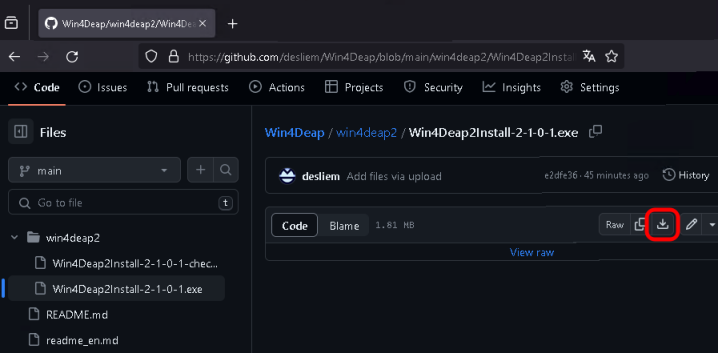

 MDeap 2

**Version 2.0.0.1**  
**© copyright 2015 Michel Deslierres**

**MDeap 2** est une application Windows autonome et conviviale capable de calculer des modèles d'enveloppement de données de base (DEA). Il peut calculer des modèles CCR et BCC avec une orientation entrée ou sortie. Dans le cas des modèles BCC, les rendements d'échelle peuvent être constants, non croissants, non décroissants, variables ou généraux (limités). Il peut également calculer l’efficacité allocative (coût et revenus). Les programmes linéaires sont résolus avec la bibliothèque **lp_solve** incluse dans l'installation.

**MDeap 2** est une application Windows 32 bits. Elle a été testée sur Windows 7, 8.1 et 10 (64-bits dans les trois cas), mais il est probable qu'elle fonctionne versions 32-bits et 64-bits de Windows à partir de Windows XP.

<!-- TOC -->

- [1. Installation](#1-installation)
  - [1.1. Types d'installation](#11-types-dinstallation)
  - [1.2. Instructions](#12-instructions)
- [2. Exemples de fichiers](#2-exemples-de-fichiers)
- [3. Utilisation de MDeap 2](#3-utilisation-de-mdeap-2)
- [4. Suppression de MDeap 2](#4-suppression-de-mdeap-2)
- [5. AVIS DE NON-RESPONSABILITÉ et AVERTISSEMENT](#5-avis-de-non-responsabilité-et-avertissement)
- [6. Remerciement](#6-remerciement)
- [7. Dernières modifications](#7-dernières-modifications)

<!-- /TOC -->

## 1. Installation

Le programme d'installation de la dernière version de **MDeap 2** est disponible ici. Pour l'obtenir, cliquez sur le lien : [MDeap2Install-2-0-0-1.exe](MDeap2Install-2-0-0-1.exe).

Cliquez ensuite sur l'icône `Download raw file` pour lancer le téléchargement. Quand ce dernier est complété,  vérifiez la somme de contrôle du fichier téléchargé.

| Algo. | somme de contrôle de MDeap2Install-2-0-0-1.exe |
|---    |--- |
| md5   | 7d1fc8f52ce51ae18cbec0c49084a5c3 |
| sha1  | 9408bb1c994d6d95d0acb8fb3fd693ee9e776e80 |

### 1.1. Types d'installation

**MDeap 2** peut être exécuté comme une application Windows « standard » ou comme une application « portable ».

- Les fichiers `.wdjson` seront associés à  **MDeap 2** lors de l'installation standard, ce qui nécessite de modifier les informations de configuration sauvegardées dans le registre de Windows. De plus, le fichier de configuration de l'application et ses fichiers de données seront stockés dans les dossiers standards.

- Une application portable de **MDeap 2** n'apportera aucune modification au registre de Windows. Par défaut, le fichier de configuration et les fichiers de données de l'application seront stockés dans le dossier contenant l'application.

Le plus souvent, un programme portable est installé sur un support amovible tel que des clés USB. Mais il est tout à fait possible de choisir d'effectuer une installation portable dans un dossier d'un disque dur. Assurez-vous simplement que vous disposez des droits de lecture et d’écriture sur ce dossier.

Le type d'installation est précisé à la toute fin du processus d'installation.

### 1.2. Instructions

1. Sélectionnez la langue d'installation (anglais ou français). Il s'agit de la langue utilisée par le programme d'installation et n'a rien à voir avec la langue utilisée dans **MDeap 2**.

1. Lisez l'écran de bienvenue et cliquez sur `Suivant >`.

1. Lisez le contrat de licence, sélectionnez `Je comprends et j'accepte les termes du contrat de licence` si c'est acceptable, puis cliquez sur `Suivant >`.

1. Sélectionnez le dossier de destination.
   - Pour une installation standard, vous pouvez probablement accepter l'emplacement par défaut.
   - Pour une installation portable, accédez à un dossier dans lequel vous disposez des autorisations complètes de lecture et d’écriture. Cela exclut les dossiers `Windows`, `Program Files` et, sur les systèmes 64 bits, `Program files (x86)`.
   
   Cliquez sur  `Suivant >`.

1. Sélectionnez le dossier du menu Démarrer.
   - Pour une installation standard, vous pouvez probablement accepter l'emplacement par défaut.
   - Pour une installation portable, acceptez la valeur par défaut, elle sera ignorée dans tous les cas, car rien ne sera ajouté au menu Démarrer.
   
   Cliquez sur  `Suivant >`.
   
1. Sélectionnez le type d'installation (standard ou portable). Il est également possible d'inclure ou non la prise en charge des langues nationales. Actuellement **MDeap 2** est disponible en deux langues : anglais et français. Il sera possible de traduire vers d'autres langues si le support des langues nationales est inclus.  

   Cliquez sur  `Suivant >`.

1. Enfin, cliquez sur le bouton `Installer` et, une fois l'installation terminée, cliquez sur le bouton `Terminer`.

Si une installation standard est choisie, l'extension `.wdjson` est associée à **MDeap 2**. Conséquemment, `MDeap2.exe` sera lancé quand un fichier avec cette extension est double-cliqué. Un programme de désinstallation est également installé dans le même dossier que `MDeap2.exe`. Enfin, un élément de menu sera ajouté au menu Démarrer. Si une installation portable est sélectionnée, l'association de fichiers, un élément de menu démarrer et le programme de désinstallation ne sont pas créés.

## 2. Exemples de fichiers

Certains exemples de fichiers de projet sont fournis au format **MDeap 2** (extension `.mdjson`). Ils se trouvent dans un dossier appelé, de manière appropriée, `Exemples`. Dans une installation standard, ce dossier sera contenu dans le sous-dossier `MDeap2` du dossier `Documents` de l'utilisateur. Dans une installation portable, `Exemples` sera dans le dossier contenant `MDeap2.exe`.

## 3. Utilisation de MDeap 2

Le fichier d'aide de **MDeap 2** n'est pas complet. Néanmoins, il ne devrait pas être trop difficile de comprendre comment utiliser ce programme.

L'application fournit une grille semblable à une feuille de calcul pour saisir et modifier des données. L’ensemble des données ou à des sous-ensembles de celui-ci peuvent être analysés selon plusieurs modèles AED. La spécification des modèles est une opération pointer-cliquer. Les résultats d'analyse AED sont présentés dans une série de tableaux qui peuvent facilement être copiés vers d'autres applications. 

Appuyez sur F1 pour obtenir une aide contextuelle, lorsqu'elle est disponible.

**MDeap 2** peut lire les fichiers de projet [**Win4Deap 2**](https://github.com/desliem/Win4Deap) et vice versa.

## 4. Suppression de MDeap 2

Un programme de désinstallation est installé avec `MDeap2.exe` si une installation standard a été effectuée. Si une installation portable a été choisie, il suffit de supprimer manuellement les fichiers installés puisqu'aucune modification n’avait été apportée au système.

## 5. AVIS DE NON-RESPONSABILITÉ et AVERTISSEMENT

**MDeap 2** est un logiciel gratuit fourni tel quel. L'auteur du programme n'accepte aucune responsabilité pour les dommages qui pourraient être causés par ce logiciel et n'offre aucune garantie, implicite ou implicite, quant à son adéquation à quelque usage que ce soit. L'utilisateur assume tous les risques associés au programme. Veuillez lire l'avis de droit d'auteur et le contrat de licence pour en savoir plus.

**MDeap 2** devrait être considéré comme un logiciel bêta. Sauvegardez les données souvent au format natif `.wdjson` et au format CSV standard.

## 6. Remerciement

Tous les modèles de programmation linéaire nécessaires aux calculs DEA sont réalisés par la bibliothèque **lp_solve** (publiée sous licence LGPL 2.1). Elle peut être trouvée sur https://lpsolve.sourceforge.net/.

Merci à Jordan Russell pour le compilateur Inno Setup qui a été utilisé pour créer le programme d'installation. Le compilateur d'installation est disponible sur le Web à l'adresse http://www.innosetup.com.

La plupart des icônes proviennent du jeu d'icônes Silk de Mark James publié sous la licence Creative Commons Attribution 2.5 : ~~http://www.famfamfam.com/lab/icons/silk/~~ n'est plus en ligne, mais voir https : //github.com/legacy-icons/famfamfam-silk.

L'icône de l'application a été créée avec l'application open source Greenfish Icon Editor Pro : http://greenfishsoftware.org/.

## 7. Dernières modifications

Version 2.0.0.1 Changement du numéro de version à 2 pour correspondre au nom de l'application et correction de nombreux bugs mineurs.

Version 0.9.3.2 De nombreuses corrections d'erreur, notamment lors de l'importation de fichiers CSV avec des prix, et lorsque le nom d'un fichier lu contenait des caractères non ASCII. Exportation au format HTML de toutes les tables complété. Ajout de l'enregistrement de toutes les tables dans des fichiers CSV.

Version 0.9.2.11 - première version publique.
